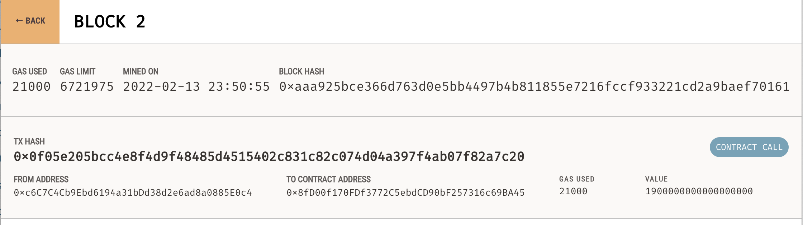
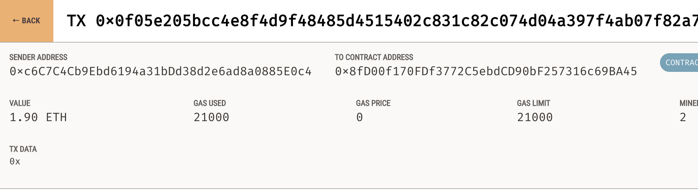

# CryptoWallet

In this repo we are going to generate a wallet based on mnemonic phrase provided by Ganache. The isplay the Ethereum account balance, calculate the value of the transaction including the gas estimate, digitally sign a transaction that pays a Fintech Finder candidate, and send this transaction to the Ganache blockchain. 


## Technologies

* [Streamlit](https://streamlit.io/)

To install it run the following command line in the Terminal

            ```pip install streamlit ```

Download and install Ganache
 
* [Ganache](https://trufflesuite.com/ganache/) 

* Web3.py- A Python library for connecting to and performing operations on Ethereum-based blockchains.

            ```pip install web3==5.17```

* mnemonic- A Python implementation for generating a 12- or 24-word mnemonic seed phrase based on the BIP-39 standard.
            ```pip install mnemonic```

* bip44 - A Python implementation for deriving hierarchical deterministic wallets from a seed phrase based on the BIP-44 standard.
            ```pip install bip44```


## Usage

* Clone the repository.

* Open Ganache blockchain.

* Create ```.env``` file with your own mnemonic phrase provided by Ganache like this

``` MNEMONIC="your mnemonic phrase provided by Ganache"```

* In the Terminal navigate to the folder where the ```fintech_finder.py```  is, then run the following in the command line:

```streamlit run fintech_finder.py```

See the video below how it works

[Streamlit in Action - "Ethereum transfer using Ganache blockchain"](Readme_pics_vid/Screen_Recording.mov)

When the transaction is successful the hash will be created:




## Contributor

Nara Arakelyan

---

## Licence 

UC Berkley
    


